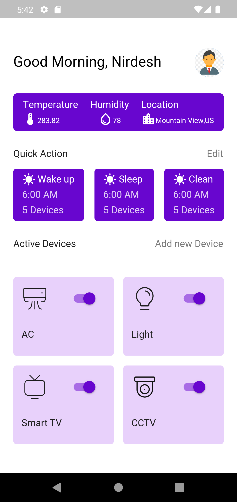
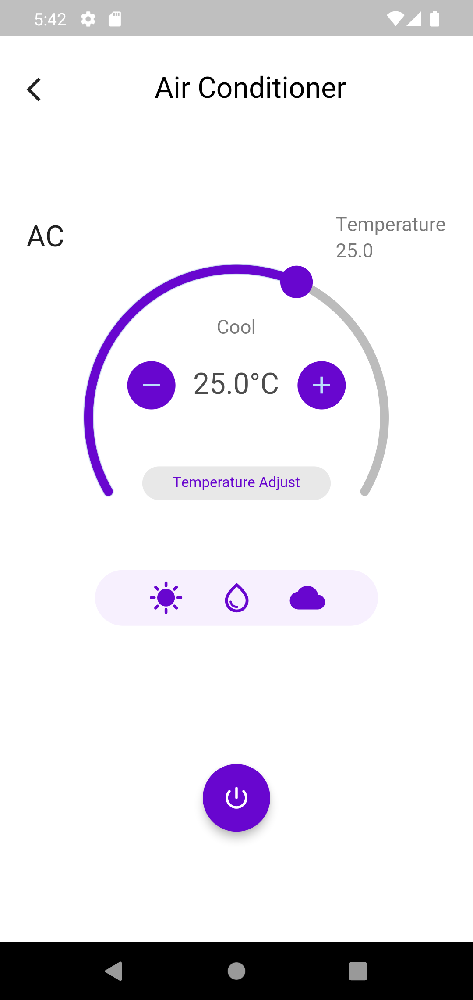
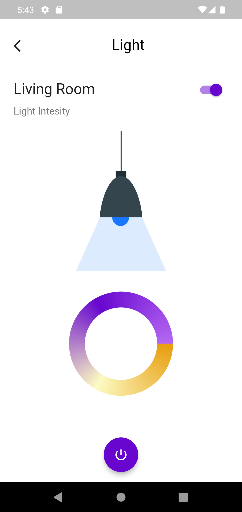
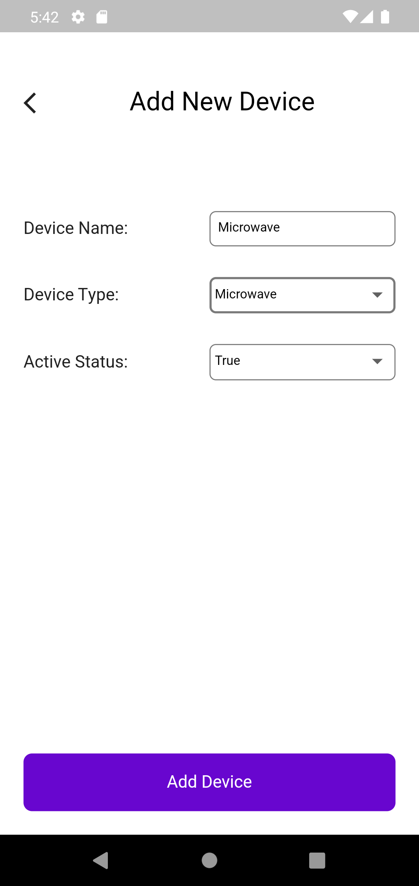
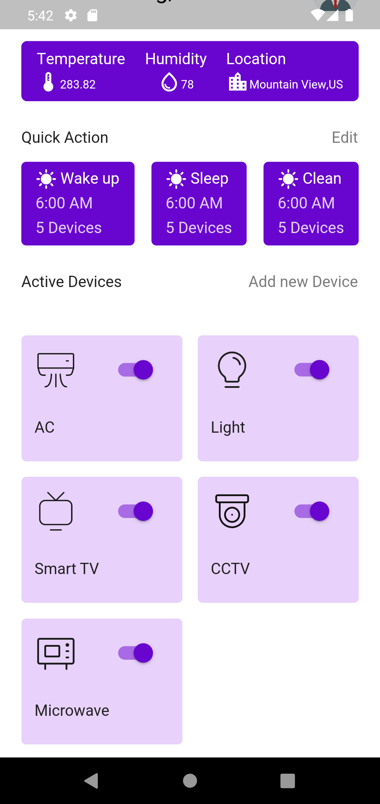

# smart_home_flutter
This repository contains the frontend code for the Flutter smart home app. The app is coded in flutter and is set to build android and iOS mobile versions.

This app is built with following configuration:

Flutter 3.0.2 • channel stable,
Dart 2.17.3

## Checkout
You can use the following command to checkout the code.

git checkout https://github.com/FlutterFreak/smart_home_flutter

Once you check out the code, please run the following commands to get dependencies.

flutter clean

flutter pub get

flutter pub upgrade

flutter pub run build_run build --delete-conflicting-outputs

> **Note:** Build Runner is used to generate dart code in general. In our project it is used only for generating mockito and network exceptions code.

## Test
Runs a test in the specified directory.

flutter test <test-file-dir>

Runs a test with coverage in the specified directory.

flutter test --coverage <test-file-dir>

Runs all tests

flutter test --coverage

Run below command for generating code coverage html

genhtml coverage/lcov.info -o coverage/html

Run to see coverage

open coverage/html/index.html

